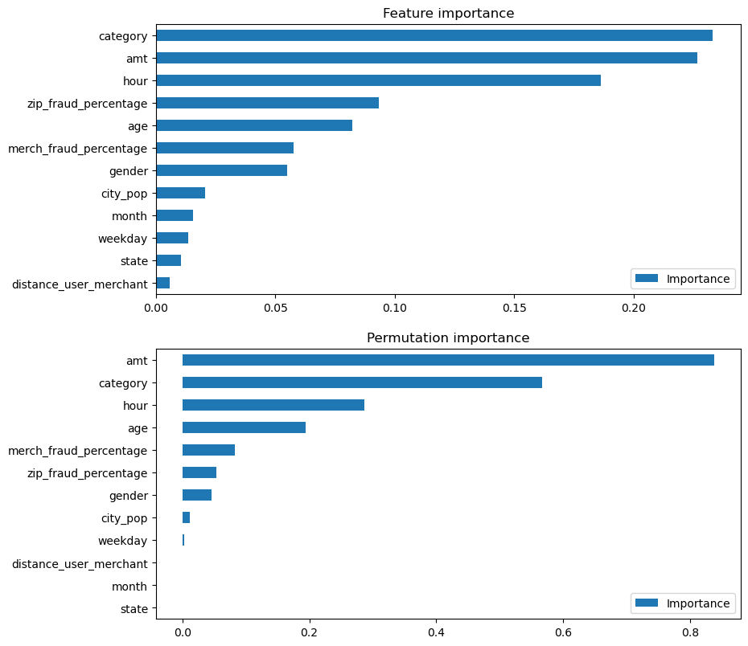
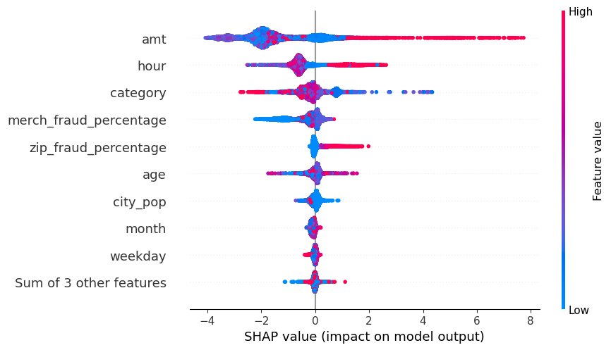

# fraudprediction

# Introduction
Fraud is constantly on the rise alongside technology. This makes fraud detection important. The big obstacle is to understand how to detect fraud. This project aims to understand which features have better ability to predict fraud. This is done with a credit card fraud dataset that gets analysed with supervised machine learning using the XGBoost algorithm. 

# Dataset
The dataset is taken from Kaggle (https://www.kaggle.com/datasets/kartik2112/fraud-detection). It consists of 23 columns and X transactions. 

# Insights from EDA with visualisations

Dashboard amount category

- Transactions amounts are very skewed and fraudulent transactions only take on values from around 1 to 1400 USD. This means that there are quite large outliers but that these outliers are not relevant for fraud.
- Grocery shopping on location and shopping online are the most common categories of fraudulent transactions. 

Dashboard time age
- Most transactions are made during weekends and during 21:00-22:00 in the evening
- Age does not have a clear pattern when it comes to fraud, as it is very unevenly distributed.

# Analysis and results

To understand the most important features, I am using four measures:
- Feature importance: The XGBoost model can list the features that most contributed to the predictions.
- Permutation importance: This explores how important the feature is by measuring the perforfance of the model with the feture removed. The steeper drop in performance, the more important the feature is. 
- SHAP values: SHAP measures feature importance differently by distributing the impact of each feature evenly on the final result. 
- Correlation matrix: This matrix showcases how correlated the feature is to the fraud. 

  

Amount, merchant fraud percentage, zip code fraud percentage, and category are the most correlated with the is_fraud variable, while distance between user and merchant, weekday, and state are the least correlated.

Insert feature importance and permutation importance plots. shap plot
  

In general, amount, category, and hour have the most effect on predicting fraud. 
Amount seems to have higher predicting power according to permutation importance, correlation matrix, and SHAP values. 
Category is the most important feature according to the feature importance, with amount being a close second. Category and hour switches between being on the second and third places as important feature. The exception is the correlation analysis, where previous fraud in the form of percentage of fraud for merchants and zip codes were more important than hour. Age has medium importance in all measures. 

  
This beeswarm plot shows how each transaction contributed to the prediction of fraud. The values on the X-axis shows if the feature lowers or increases the likelihood of fraud. The colour shows if the features values are high or low. Higher values of amount and hour seem to increase likelihood of fraud. It seems that both lower and higher values decreases the likelihood for fraud. Category is a mixed bag, but it is a nominal variable and therefore the values themselves cannot say anything. Lower values of merchant fraud percentage lowers the likelihood of fraud, while higher zip fraud percentages increases the likelihood of fraud. These features do not seem to have any bigger effect on increasing respectively decreasing the likelihood. 

Amount should be examined further. It was the feature with highest explaining power, but the relationship between amount and fraud seems quite fragmented. All fraudulent transactions in the dataset were in the 0-2000 USD group, with no high outliers, while the amounts for all transactions have more high outliers. Therefore, it is difficult to say if a certain amount predicts fraud and the feature should be examined for how it predicts fraud. 

Age seems to be mildly important according to the correlation and feature importance, but low importance with SHAP. 

Previous fraud seen to zip codes and merchants are moderately correlated with fraud, but is less important to predict fraud with the machine learning model. Zip code previous fraud percentage has low importance seen to the SHAP values, but is higher seen to the feature importance, while merchant previous fraud is the other way around. 

Location and time based variables did not have effect on predicting fraud, with the exception of hour. This could infer that the hour can predict fraud, as the EDA showed that most fraud take place during 21:00-22:22 in the evening. Month was moderately correlated with fraud but did lose all its importance for the machine learning model. 

# Conclusion
Amount, category, hour are the features that can predict fraud the most, with previous fraud and age as complement. The variables amount and category should be explored to understand how they predict fraud and how they interact. 
